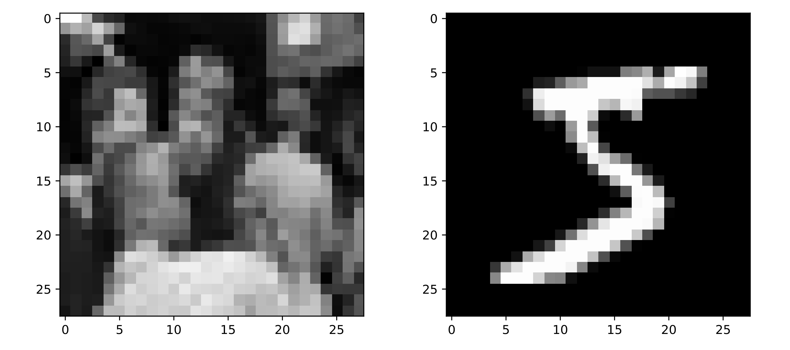
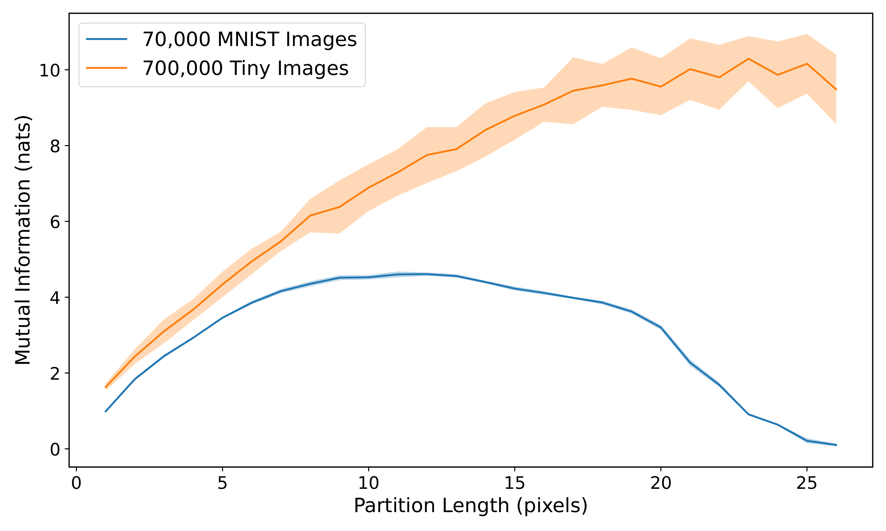

Implements the mutual information estimation algorithm and scaling analysis carried out in [Mutual Information Scaling for Tensor Network Machine Learning (2022)](https://arxiv.org/abs/2103.00105). The abstract of the paper is reproduced here:
> Tensor networks have emerged as promising tools for machine learning, inspired by their widespread use as variational ansatze in quantum many-body physics. It is well known that the success of a given tensor network ansatz depends in part on how well it can reproduce the underlying entanglement structure of the target state, with different network designs favoring different scaling patterns. We demonstrate here how a related correlation analysis can be applied to tensor network machine learning, and explore whether classical data possess correlation scaling patterns similar to those found in quantum states which might indicate the best network to use for a given dataset. We utilize mutual information as measure of correlations in classical data, and show that it can serve as a lower-bound on the entanglement needed for a probabilistic tensor network classifier. We then develop a logistic regression algorithm to estimate the mutual information between bipartitions of data features, and verify its accuracy on a set of Gaussian distributions designed to mimic different correlation patterns. Using this algorithm, we characterize the scaling patterns in the MNIST and Tiny Images datasets, and find clear evidence of boundary-law scaling in the latter. This quantum-inspired classical analysis offers insight into the design of tensor networks which are best suited for specific learning tasks.

In the Jupyter notebook `examples.ipynb`, which is reproduced below, a summary of the work is presented, along with a portion of the experiments used to generate the paper's numerical results. The full source code is given in the `src` folder, although it is missing some of the large data files that are needed for all portions of the code to run. 

# Mutual Information Scaling in Image Datasets

This notebook provides an overview of the experiments and analysis in [Convy et al. (2022)](https://iopscience.iop.org/article/10.1088/2632-2153/ac44a9) regarding mutual information scaling in image datasets. The code used throughout this notebook is adapted from the `image.py` and `mine.py` modules. 

## A brief introduction to mutual information estimation

This work focuses on a quantity called the _mutual information_ (MI), which describes the dependence between two variables $a$ and $b$ obeying the joint probability distribution $p(a, b)$. It is defined as the difference between the entropy of $p(a)p(b)$, which is the product of the marginal distributions, and the entropy of $p(a, b)$:

\begin{equation}
\text{MI}(a,b) = \text{S}[p(a)p(b)] - \text{S}[p(a, b)] = \text{S}[p(a)] + \text{S}[p(b)] - \text{S}[p(a,b)],
\end{equation}

where $\text{S}$ is the usual Shannon entopy. The MI can be qualitatively understood as a generalization of the Pearson correlation coefficient to non-linear relationships between variables, and it serves as the most general measure of dependence. This means that a non-zero correlation coefficient always implies a non-zero MI value, but the converse is not necessarily true.

Given access to the underlying probability distributions $p(a, b)$, $p(a)$, and $p(b)$, it is usually straightforward to compute the individual entropies and thus the MI. However, what if we only had access to $N$ samples from the joint distribution $p(a, b)$? If the variables are discrete and span a relatively small number of values, then the entropy could be estimated from $\text{S}[p(x)] = \sum_x p(x)\log p(x)$ using the observed frequencies in place of the probabilities. However, in cases where the variable $x$ is continuous or effectively continuous, the observed frequencies of each value in the domain will not carry sufficient information for the entropies and thus the MI to be estimated. 

To get around this issue, we need to impose some functional form on $p(a, b)$ and $p(a)p(b)$. One powerful method is to represent the probability distributions using a neural network trained on the $N$ samples from $p(a, b)$. This can be done in a straightforward manner by constructing artificial samples from the product-of-marginal distribution $p(a)p(b)$, and then optimizing the neural network model using a cross-entropy loss function to distinguish between samples from $p(a)p(b)$ and samples from $p(a, b)$. The general workflow is:

1. From samples $\{(a_i, b_i)\}^N_{i=1}$, generate a new set $\{(a_i, b_j)\}_{i \neq j}$ by randomly shuffling values for the variable $b$ between different samples. This simulates sampling from $p(a)p(b)$.
2. Train a logistic regression neural network algorithm to distinguish between samples taken from the two datasets in the previous step.
3. Use the output of the neural network to estimate the MI of $\{(a_i, b_i)\}^N_{i=1}$.

In our case, we will be interested in the MI between different sets of pixels in an image dataset, so our $a$ and $b$ variables will correspond to different groups of pixels in the same image. The shuffling in step 1 will consists of stitching together new images using pixel patches taken from the original samples.

## Testing on Gaussian Markov random fields

To ensure that our algorithm works properly, we can test it on data samples from distributions with known MI values. The most convenient class of distribution for this purpose is the Gaussian Markov random field, which is a multivariate Gaussian distribution parameterized by its _precision matrix_. The precision matrix is simply the inverse of the covariance matrix, and its off-diagonal elements determine the conditional correlation between the corresponding Gaussian variables. The following code shows functions that generate the precision matrix for three different MI patterns:


```python
import numpy as np

def get_area_law_prec(length, rho):
    q = np.eye(length**2)
    for i in range(length):
        for j in range(length):
            q_row = i * length + j
            for (m, l) in [(i + 1, j), (i - 1, j), (i, j - 1), (i, j + 1)]:
                if (m < length and m >= 0) and (l < length and l >= 0):
                    q_col = m * length + l
                    q[q_row, q_col] = rho
    return q

def get_diffuse_volume_prec(length, rho):
    q = np.full([length**2, length**2], rho)
    for i in range(length**2):
        q[i, i] = 1
    return q

def get_sparse_volume_prec(length, rho):
    gen = np.random.RandomState(123456789)
    q = np.eye(length**2)
    for i in range(length):
        for j in range(length):
            q_row = i * length + j
            for (m, l) in [(i + 1, j), (i - 1, j), (i, j - 1), (i, j + 1)]:
                if (m < length and m >= 0) and (l < length and l >= 0):
                    q_col = m * length + l
                    q[q_row, q_col] = rho
    shuffle = gen.permutation(length**2)
    q = q[shuffle, :]
    q = q[:, shuffle]
    return q
```

The `get_area_law_prec` function creates a precision matrix in which variables are conditionally correlated with only their four nearest neighbors when arranged on a 2D grid. The `get_diffuse_volume_prec` function, by contrast, constructs a precision matrix in which every variable is equally correlated with every other variable, regardless of their positions on the grid. Finally, the `get_sparse_volume_prec` creates a precision matrix that is a mix of the other two, in that it starts by generating nearest-neighbor correlations but then randomizes the position of the variables on the grid. This results in each variable being correlated with four other variables at random locations on the grid.

Using samples from these Gaussian distributions (we can set the means arbitrarily to zero, since it does not affect the MI value), we can now train our neural network classifier. Because we are interested in capturing the MI structures of the different distributions, we will use a fully-connected neural network rather than, say, a convolutional network to avoid introducing spatial biases into the model. The code used to build the model is given below: 


```python
import ast

from tensorflow import keras as ks

class Model():
    def __init__(self, image_shape, settings):
        self.drop = float(settings['drop'])
        self.learn_rate = float(settings['learn'])
        self.layers = ast.literal_eval(settings['layers'])
        self.build_model(image_shape)

    def build_model(self, image_shape):
        joint_input = ks.Input(shape = image_shape)
        marginal_input = ks.Input(shape = image_shape)
        model_core = ks.models.Sequential()
        model_core.add(ks.layers.Flatten(input_shape = image_shape))
        for layer_size in self.layers:
            model_core.add(ks.layers.Dense(layer_size, activation = 'relu'))
            model_core.add(ks.layers.Dropout(self.drop))
        model_core.add(ks.layers.Dense(1, activation = None))
        joint_output = model_core(joint_input)
        marginal_output = model_core(marginal_input)
        self.model = ks.Model(inputs = [joint_input, marginal_input], outputs = [joint_output, marginal_output])
```

The model structure is fairly standard, except that the inputs and outputs are split based on the kind of image being fed in. This has been done simply to make the model easier to work with when doing MI estimation, and is not necessary.

The following code trains the model on samples from the specified Gaussian Markov random field. The size of the "image" (i.e. the grid of variables) is set to 28 x 28, which matches the size of the real image datasets that we will be working with later on. The samples are separated into two regions, a square set of variables in the middle of the grid and the remaining set of pixels surrounding it. The collective states of these two pixel patches represent the variables $a$ and $b$ whose correlation we will be aiming to estimate. 


```python
import itertools

import numpy as np

from src import mine, image as img

image_type = "diffuse" # Set to "area". "diffuse", or "sparse".
strength = "large" # Set to "small" or "large"
num_images = 700000
inner_length = 10
batch_size = 64
max_epochs = 100
model_settings = dict(
    drop = 0, 
    learn = 1e-4, 
    layers = "[256, 256]", 
    patience = 20, 
    optm = "rms")

rho = img.rho_values[image_type][strength]
print(f"Sampling {num_images} images...")
(images, _, _) = img.get_images(image_type, num_images, strength)
(_, height, width) = images.shape
images = np.expand_dims(images, axis = 3)
inner_region = img.get_center_region(inner_length, height, width)

model = mine.LogsiticRegression(images.shape[1:], model_settings)

val_start = int(images.shape[0] * float(1 / 7))
train_images = images[val_start:]
val_images = images[:val_start]

train_steps = np.ceil(train_images.shape[0] / batch_size)
val_steps = np.ceil(val_images.shape[0] / batch_size)

train_itr = mine.get_finite_dataset(train_images, inner_region, batch_size, loop = True)
val_itr = itertools.cycle(mine.get_finite_dataset(val_images, inner_region, batch_size, loop = False))

print("Training model...")
model.train(train_itr, val_itr, train_steps, val_steps, max_epochs)
```

After the model has been trained, it can evaluate the MI of a dataset using two different equations. In _direct_ estimation, we compute the average log-ratio of $p(a, b)$ and $p(a)p(b)$ to get the MI. In _indirect_ estimation, we compute this same log-ratio but then subtract a quantity that should be zero if the MI estimate is exact, but will otherwise cancel some of the error in the direct estimate. Either approach may be preferred depending on the nature of the target dataset. The following method function of the `Model` class uses the trained model to compute both MI estimates:


```python
import numpy as np

def evaluate_MI(self, image_iterator, num_steps):
    cum_joint = 0
    cum_marginal = 0
    for (count, (image_batch, _)) in enumerate(image_iterator):
        [joint_outputs, marginal_outputs] = self.model.predict_on_batch(image_batch)
        cum_joint += np.mean(joint_outputs)
        cum_marginal += np.mean(np.exp(marginal_outputs))
        if count >= num_steps:
            break
    indirect_mi = cum_joint / num_steps - np.log(cum_marginal / num_steps)
    direct_mi = cum_joint / num_steps
    return (indirect_mi, direct_mi)
```

When the models are trained on center patches of different lengths, their estimates can be combined together to show how the MI scales with the size of the patch. By averaging over a sufficient number of models, we can generate the following plots:


with the three rows corresponding to `get_area_law_prec`, `get_diffuse_volume_prec`, and `get_sparse_volume_prec` respectively, while the two columns correspond to small and large correlation strengths respectively. We can see that each of the three forms for the precision matrix gives rise to a different pattern of MI scaling, and that the model estimates are able to closely match the exact MI in most cases, especially when the training set is large.

## MI scaling of MNIST and Tiny Images

Now that we have verified that the model is able to perform accurate MI estimation, we can carry out experiments on real image datasets. The two datasets we will focus on are MNIST and the Tiny Images, with MNIST having simple images of digits and the Tiny Images set having much more complicated images scraped from the internet. Example images from each dataset are shown below:




Note that the Tiny Images have been cropped from $32 \times 32$ to $28 \times 28$, and converted to grayscales using the following weighted luminance coding:


```python
def convert_to_grayscale(images):
    (r, g, b) = (0.3, 0.59, 0.11)
    grayscale = r * images[..., 0] + g * images[..., 1] + b * images[..., 2]
    return grayscale
```

The neural network model introduced in the previous section can be trained on MNIST and the Tiny Images datasets in precisely the same manner as it was for the Gaussian Markov random fields. As an example, the following code block trains a model for MI estimation on MNIST:


```python
import itertools

import numpy as np

from src import mine, image as img

num_images = 70000
inner_length = 10
batch_size = 64
max_epochs = 100
model_settings = dict(
    drop = 0, 
    learn = 1e-4, 
    layers = "[256, 256]", 
    patience = 20, 
    optm = "rms")

(images, _, _) = img.get_images("mnist", num_images, strength)
(_, height, width) = images.shape
images = np.expand_dims(images, axis = 3)
inner_region = img.get_center_region(inner_length, height, width)

model = mine.LogsiticRegression(images.shape[1:], model_settings)

val_start = int(images.shape[0] * float(1 / 7))
train_images = images[val_start:]
val_images = images[:val_start]

train_steps = np.ceil(train_images.shape[0] / batch_size)
val_steps = np.ceil(val_images.shape[0] / batch_size)

train_itr = mine.get_finite_dataset(train_images, inner_region, batch_size, loop = True)
val_itr = itertools.cycle(mine.get_finite_dataset(val_images, inner_region, batch_size, loop = False))

model.train(train_itr, val_itr, train_steps, val_steps, max_epochs)
model.evaluate_MI(val_itr, 5000)
```

As with the Gaussian distributions in the previous section, we can compute MI estimates for pixel patches of different sizes and plot how the MI changes. By averaging over many such models, we generate the following plot which shows the MI scaling behavior for both MNIST and the Tiny Images datasets:



The difference in scaling behavior between the two datasets is stark, with the Tiny Images dataset showing a fairly linear pattern that is very reminiscent of the nearest-neighbor Gaussian Markov random field. This would suggest that local correlations are more dominant in the Tiny Images than in MNIST. 
